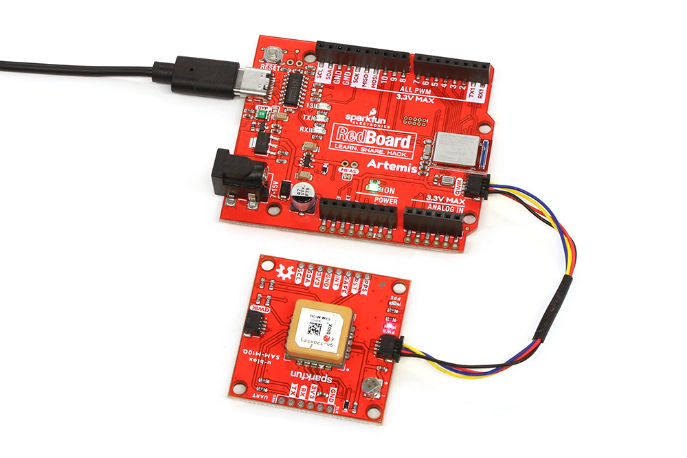

Now that we're familiar with the hardware on this breakout, let's assemble it into a Qwiic circuit with the [SparkFun RedBoard Artemis]().

## Qwiic Assembly

With the Qwiic system, simply connect the GNSS Breakout to your chosen Qwiic-enabled microcontroller (in this case the RedBoard Artemis) using a Qwiic cable like the image below:

[{ width="600" }](./assets/images/u-blox_SAM-M10Q-Assembly.jpg "Click to enlarge")

Since the SAM-M10Q has an on-chip antenna, no external antenna is required so just plug your microcontroller into your computer and start using the board with the SparkFun u-blox Arduino Library.

## Soldered Assembly

If you prefer to configure and use the SAM-M10Q's with u-center either through UART or I2C or if you want a traditional soldered connection should solder to the board's PTH headers. If you've never done through-hole soldering before or would like a refresher or tips, check out our [How to Solder: Through-Hole Soldering](https://learn.sparkfun.com/tutorials/5) tutorial:

-   <a href="https://learn.sparkfun.com/tutorials/5">
    <figure markdown>
    
    </figure>
    </a>

