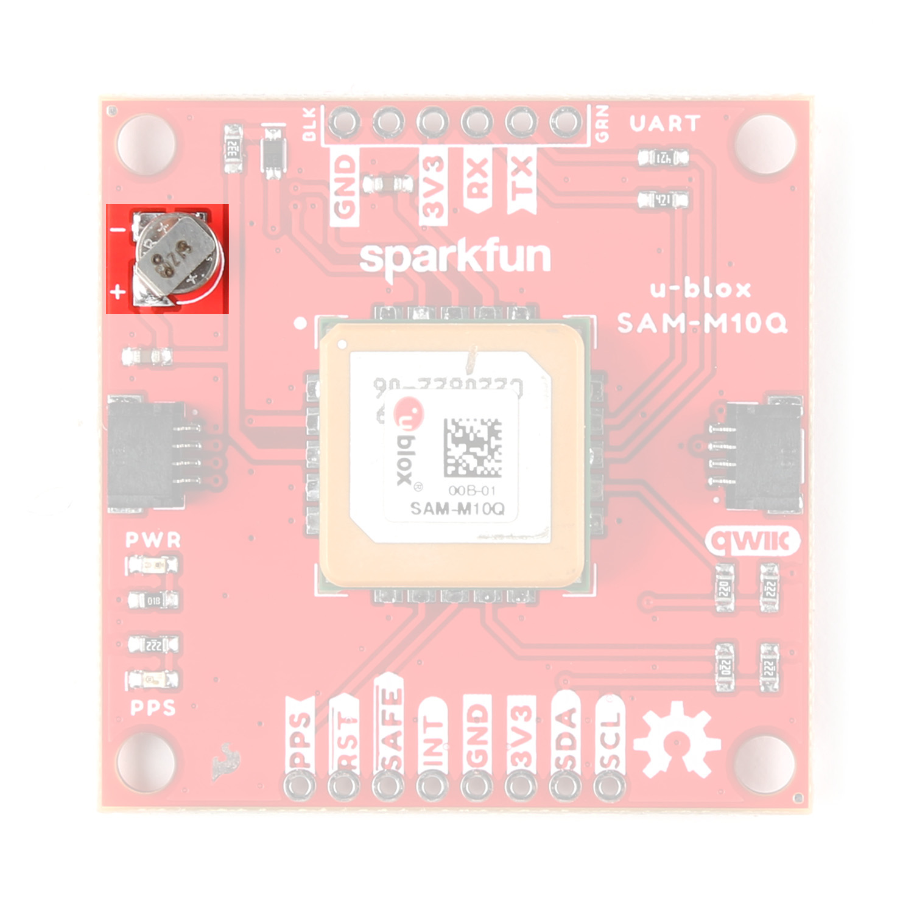

Let&apos;s take a closer look at the SAM-M10Q and other hardware on this GPS breakout.

## SAM-M10Q

The SAM-M10Q GNSS module from u-blox is from the M10 series of modules and features a chip antenna. The chip antenna removes the need for an external antenna and we designed this board to mount the module on a large ground plane to help maximize the reception quality. 

[{ width="600" }](./assets/images/u-blox_SAM-M10Q-Module.jpg "Click to enlarge")

The module can receive up to four GNSS constellations at a time allowing for excellent signal quality and reliability even in areas with limited view of the sky. More GNSS locks reduce the update rate of the SAM-M10Q so users should take into consideration which is more important for their application. The SAM-M10Q has a max altitude of 80,000m and max velocity of 500m/s with an acceleration limit of &le; 4g. The module also has a time pulse signal with a RMS accuracy of 30ns. This signal defaults to 1 pulse per second but is configurable between 0.25Hz to 10MHz. For a complete overview of the SAM-M10Q refer to the [datasheet](./assets/component_documentation/SAM-M10Q_DataSheet_UBX-22013293.pdf) and [integration manual](./assets/component_documentation/SAM-M10Q_IntegrationManual_UBX-22020019.pdf). The tables below outline some of the SAM-M10Q&apos;s capabilities in single-GNSS and multi-GNSS modes:

<table>
    <th colspan="7"><b>Single GNSS Constellation Mode</b></th>
    <tr align="center">
        <td align="left">Parameter</td>
        <td>Condition</td>
        <td>Units</td>    
        <td>GPS</td>    
        <td>GLONASS</td>        
        <td>Galileo</td> 
        <td>BeiDou</td>
    </tr>   
    <tr align="center">
        <td align="left">Horizontal Position Accuracy</td>
        <td>-</td>
        <td>m</td>
        <td>1.5</td>
        <td>4</td>
        <td>3</td>
        <td>2</td>
    </tr>
    <tr align="center">
        <td align="left">Max Navigation Update Rate</td>
        <td>-</td>
        <td>Hz</td> 
        <td>18</td>
        <td>18</td>
        <td>18</td>
        <td>18</td>       
    </tr> 
    <tr align="center">
        <td rowspan="2" align="left">Time-To-First-Fix</td>
        <td>Cold Start</td>
        <td rowspan="2">s</td>
        <td>29</td>
        <td>27</td>
        <td>41</td>
        <td>56</td>
    </tr>
    <tr align="center"> 
        <td>Hot Start</td>
        <td>1</td> 
       	<td>1</td>
        <td>1</td> 
        <td>1</td>
    </tr>
    <tr align="center">
        <td align="left" rowspan="4">Sensitivity</td>
        <td>Cold Start</td>
        <td rowspan="4">dBm</td>
        <td>-146</td>
        <td>-145</td> 
        <td>-139</td> 
        <td>-134</td>
    </tr>
    <tr align="center"> 
        <td>Hot Start</td> 
        <td>-157</td> 
        <td>-157</td>
        <td>-153</td> 
        <td>-155</td>
    </tr>   
    <tr align="center">
        <td>Tracking and Navigation</td>
        <td>-165</td>
        <td>-164</td>
        <td>-159</td> 
        <td>-161</td> 
    </tr>
    <tr align="center">
        <td>Reacquisition</td> 
        <td>-158</td> 
        <td>-156</td> 
        <td>-152</td> 
        <td>-154</td> 
    </tr>
</table>
<table>
    <th colspan="7">Multi-GNSS Constellation Modes</th>
    <tr align="center">
        <td align="left">Parameter</td>
        <td>Condition</td>
        <td>Units</td>
        <td>GPS+GAL+BDS+GLO</td>
        <td>GPS+GAL+GLO</td>
        <td>GPS+GAL+BDS</td>
        <td>GPS+GAL</td>
    </tr>
    <tr align="center">
        <td align="left">Max Navigation Update Rate</td>
        <td>-</td>
        <td>Hz</td>
        <td>5</td>
        <td>7</td>
        <td>8</td>
        <td>10</td>
    </tr>
    <tr align="center">
        <td align="left">Horizontal Position Accuracy</td>
        <td>-</td>
        <td>m</td>
        <td>1.5</td>
        <td>1.5</td>
        <td>1.5</td>
        <td>1.5</td>
    </tr>
    <tr align="center">
        <td align="left" rowspan="2">Time-To-First-Fix</td>
        <td>Cold Start</td>
        <td rowspan="2">s</td>
        <td>23</td>
        <td>23</td>
        <td>28</td>
        <td>28</td>
    </tr>
    <tr align="center">
        <td>Hot Start</td>
        <td>1</td>
        <td>1</td>
        <td>1</td>
        <td>1</td>
    </tr>
    <tr align="center">
        <td align="left" rowspan="4">Sensitivity</td>
        <td>Tracking and Navigation</td>
        <td rowspan="4">dBm</td>
        <td>-165</td>
        <td>-165</td>
        <td>-165</td>
        <td>-165</td>
    </tr>
    <tr align="center">
        <td>Reacquisition</td>
        <td>-158</td>
        <td>-158</td>
        <td>-158</td>
        <td>-158</td>
    </tr>
    <tr align="center">
        <td>Cold Start</td>
        <td>-146</td>
        <td>-146</td>
        <td>-146</td>
        <td>-146</td>
    </tr>
    <tr align="center">
        <td>Hot Start</td>
        <td>-157</td>
        <td>-157</td>
        <td>-157</td>
        <td>-157</td>
    </tr>
</table>

## Backup Battery

This breakout includes a small 3V/1mAh lithium battery to power relevant systems inside the SAM-M10Q that allow for a quick acquisition of satellites. On first start up, time to first fix is about ~23 seconds, but after it has a lock the battery allows for a hot start and can drop the time to fix down to one second. A hot start and lasts for four hours after the board is powered down and the board charges it slowly when powered.

[{ width="600" }](./assets/images/u-blox_SAM-M10Q-Battery.jpg "Click to enlarge")

## Qwiic & Through Hole Connections

As the name suggests, this breakout includes a pair of Qwiic connectors to integrate the SAM-M10Q into an existing Qwiic system. The board also includes a pair of 0.1"-spaced plated through hole (PTH) headers for the SAM-M10Q's UART interface as well as several other function pins.

[{ width="600" }](./assets/images/u-blox_SAM-M10Q-Interfaces.jpg "Click to enlarge")

### Qwiic Connectors

The two Qwiic connectors route the I2C lines (SDA/SCL) as well as 3.3V and Ground allowing for power and I2C communication with no soldering required. These connectors offer the best and easiest way to get started using this board with the SparkFun u-blox GNSS Arduino Library as many of the examples included in it assume an I2C connection between the SAM-M10Q and microcontroller.

### Plated Through Hole Headers

The breakout also includes two sets of 0.1"-spaced plated through hole (PTH) headers. One routes the SAM-M10Q&apos;s UART interface to a header matching the pinout of our [Serial Basic](https://www.sparkfun.com/products/15096) and other USB-to-UART boards. The other routes the I2C interface, interrupt (INT), safeboot (SAFE), reset (RST), and time pulse (PPS) pins.

The UART header mates with a <b>3.3V</b> Serial Basic or other USB-to-UART converter. Make sure a connected converter runs at <b>3.3V</b> and not <b>5V</b>.

The PPS outputs pulse trains synchronized with the GPS or UTC time grid. The signal defaults to once per second but is configurable over a wide range. Read the u-blox Receiver Protocol Specification in the Resources and Going Further section for more information. The Reset (RST) pin resets the chip. The next pin, SAFE is used to start up the IC in safe boot mode. The final pin INT can be used to wake the chip from power save mode.

## LEDs

The board has two LEDs labeled <b>PWR</b> and <b>PPS</b>. The Power (PWR) LED indicates when the board is powered. The Pulse Per Second (PPS) LED connects to the module&apos;s timepulse pin. This signal generates a pulse that is synchronized with a GPS or UTC time grid. By default, it pulses once every second but can be adjuted to different time values. 

[{ width="600" }](./assets/images/u-blox_SAM-M10Q-LEDs.jpg "Click to enlarge")

## Solder Jumpers

There are three solder jumpers on the board labeled: <b>I2CPUR</b>, <b>PWRLED</b> and <b>PPSLED</b>. 

[{ width="600" }](./assets/images/u-blox_SAM-M10Q-Jumpers.jpg "Click to enlarge")

The I2CPUR is a three-way jumper connecting the SDA/SCL lines to 3.3V through a pair of <b>2.2k&ohm;</b> resistors. Open the jumper completely by severing the traces between all three pads to disable the pullup resistors on the I2C bus. The other two jumpers complete the power circuits for their respective LEDs (Power and Pulse Per Second). Open the solder jumpers to disable these LEDs to reduce total power consumption of the board.

## Board Dimensions 

This GPS breakout is slightly bigger than a typical Qwiic board due to the expanded ground plane around the SAM-M10Q module and measures 1.6" x 1.6" (40.64mm x 40.64mm). The board includes four mounting holes that fit a [4-40 screw](https://www.sparkfun.com/products/10453).

[{ width="600" }](./assets/board_files/SparkFun_u-blox_SAM-M10Q_Dimensions.png "Click to enlarge")

